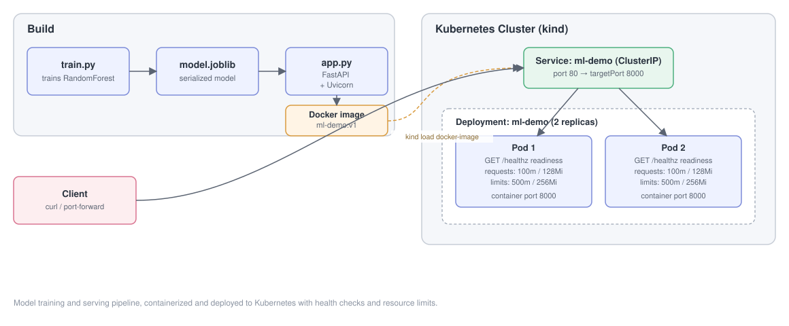

# ML Model Serving on Kubernetes

End-to-end ML model deployment on Kubernetes — containerized inference service with health checks, autoscaling-ready architecture, and automated self-healing via Kubernetes Deployments.

## What this project demonstrates

- Training and serializing a scikit-learn model
- Wrapping a model in a FastAPI inference service
- Containerizing the service with Docker
- Deploying to Kubernetes with health checks, resource limits, and replicas
- Verifying traffic routing through a Kubernetes Service
- Observing Kubernetes' self-healing (Deployment reconciliation)

## Architecture



## Stack

- **Model:** scikit-learn (RandomForestClassifier, trained on the Iris dataset)
- **API:** FastAPI + Uvicorn
- **Container:** Docker
- **Orchestration:** Kubernetes (tested on kind)

## Project structure

```
ml-on-k8s/
├── train.py          # Trains and saves the model
├── model.joblib       # Serialized model
├── app.py             # FastAPI inference service
├── Dockerfile
└── k8s/
    ├── deployment.yaml
    └── service.yaml
```

## Running locally

```bash
python train.py
uvicorn app:app --reload
curl -X POST localhost:8000/predict -H "Content-Type: application/json" -d "[5.1, 3.5, 1.4, 0.2]"
```

## Running on Kubernetes (kind)

```bash
docker build -t ml-demo:v1 .
kind create cluster --name mlops-demo
kind load docker-image ml-demo:v1 --name mlops-demo
kubectl apply -f k8s/
kubectl port-forward svc/ml-demo 8080:80
curl -X POST localhost:8080/predict -H "Content-Type: application/json" -d "[5.1, 3.5, 1.4, 0.2]"
```

## Design notes

- `imagePullPolicy: IfNotPresent` is required since the image is loaded locally into
  kind rather than pulled from a registry.
- The readiness probe on `/healthz` ensures Kubernetes doesn't route traffic to a
  pod before the model has finished loading.
- Resource requests/limits prevent a single replica from starving cluster resources.

## Model serving with KServe

In addition to the hand-written Deployment/Service approach above, this project also
serves the same model through **KServe** — a Kubernetes-native model serving platform —
to compare a manual deployment against a managed inference framework.

### KServe architecture

```
model.joblib → PersistentVolumeClaim (model-store)
→ InferenceService (KServe CRD)
→ Knative Revision + Istio ingress gateway
→ standard KServe inference protocol (/v1/models/<name>:predict)
```

### Setup

```bash
# Install KServe (RawDeployment/Knative quickstart, for local kind clusters)
curl -s "https://raw.githubusercontent.com/kserve/kserve/release-0.15/hack/quick_install.sh" | bash

# Create a PVC and copy the trained model into it
kubectl apply -f k8s/model-pvc.yaml
kubectl apply -f k8s/copy-pod.yaml
kubectl cp model.joblib copy-helper:/mnt/models/model.joblib
kubectl delete pod copy-helper   # free the PVC for the InferenceService

# Deploy the model via KServe
kubectl apply -f k8s/my-model-inference-service.yaml
kubectl get inferenceservice my-iris-model
```

### Testing

```bash
kubectl port-forward -n istio-system svc/istio-ingressgateway 8082:80

curl -H "Host: my-iris-model.default.example.com" \
  -H "Content-Type: application/json" \
  http://localhost:8082/v1/models/my-iris-model:predict \
  -d '{"instances": [[5.1, 3.5, 1.4, 0.2]]}'
```

### Manual deployment vs. KServe

| | Manual (Deployment/Service) | KServe |
|---|---|---|
| Code required | Dockerfile, Deployment, Service YAML | 5-line InferenceService YAML |
| Model packaging | Custom FastAPI wrapper | Automatic, framework-standard |
| Traffic routing | ClusterIP Service | Istio ingress gateway |
| API contract | Custom (`/predict`) | Standard (`instances`/`predictions`) |
| Autoscaling | Not configured | Built-in (Knative-based) |

### Issues encountered and resolved

- **PVC lock contention**: the InferenceService pod couldn't schedule while a helper
  pod used to copy the model file still held the PVC (`ReadWriteOnce`). Resolved by
  deleting the helper pod once the copy completed.
- **Node memory exhaustion**: running the full KServe/Knative/Istio stack alongside
  the earlier demo and an extra example InferenceService exceeded the local kind
  node's memory, causing `FailedScheduling`. Resolved by removing unused resources
  and increasing Docker Desktop's memory allocation.
- **Content-Type mismatch**: a prediction request initially failed with a confusing
  `nan` array error; the root cause was curl defaulting to
  `application/x-www-form-urlencoded` instead of JSON. Fixed by explicitly setting
  `Content-Type: application/json`.

## Next steps

- [x] Serve via KServe for autoscaling and standardized `InferenceService` API
- [ ] Add GPU-backed inference for a larger model
- [ ] Add a RAG pipeline with an in-cluster vector database
