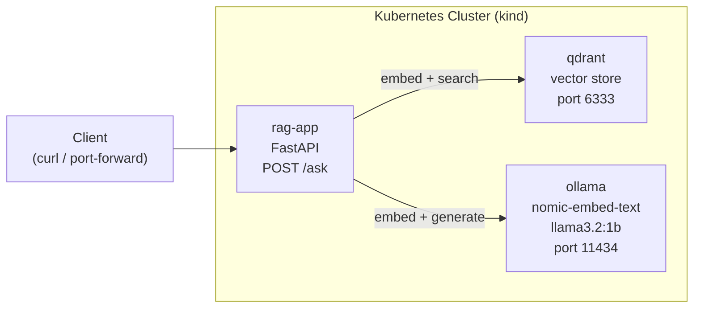

# RAG Pipeline on Kubernetes

A retrieval-augmented generation (RAG) system running entirely in-cluster — vector
search, embeddings, and generation all served from CPU-only pods on a local
Kubernetes cluster, no external APIs or GPUs required.

## What this project demonstrates

- Running a vector database (Qdrant) as a Kubernetes Deployment/Service
- Serving embedding and generation models locally via Ollama, CPU-only
- Building a retrieval-augmented generation pipeline with a FastAPI service
- Wiring multiple in-cluster services together over Kubernetes Service DNS
- Containerizing and deploying the application layer alongside its dependencies

## Architecture



**Request flow for `POST /ask`:**
1. Embed the incoming question via Ollama (`nomic-embed-text`)
2. Search Qdrant's `k8s_docs` collection for the top 3 nearest snippets
3. Build a context-grounded prompt from those snippets
4. Generate an answer via Ollama (`llama3.2:1b`)
5. Return the answer plus which snippets were retrieved

## Stack

- **Vector store:** Qdrant
- **Embeddings + generation:** Ollama (`nomic-embed-text`, `llama3.2:1b`) — CPU-only
- **API:** FastAPI + Uvicorn
- **Container:** Docker
- **Orchestration:** Kubernetes (tested on kind)

## Project structure

```
rag-on-k8s/
├── rag_app.py         # FastAPI RAG service (seeds Qdrant, exposes /ask)
├── Dockerfile
└── k8s/
    ├── qdrant-deployment.yaml
    ├── qdrant-service.yaml
    ├── ollama-deployment.yaml
    ├── ollama-service.yaml
    ├── rag-deployment.yaml
    └── rag-service.yaml
```

## Running locally

Requires `ollama` and `qdrant` reachable (e.g. via port-forward from the cluster,
see below), then:

```bash
export OLLAMA_URL="http://localhost:11434"
export QDRANT_URL="http://localhost:6333"
uvicorn rag_app:app --reload
```

## Running on Kubernetes (kind)

```bash
# Vector store and model server
kubectl apply -f k8s/qdrant-deployment.yaml -f k8s/qdrant-service.yaml
kubectl apply -f k8s/ollama-deployment.yaml -f k8s/ollama-service.yaml

# Pull models into the running Ollama pod
kubectl exec -it deploy/ollama -- ollama pull llama3.2:1b
kubectl exec -it deploy/ollama -- ollama pull nomic-embed-text

# Build and load the app image
docker build -t rag-app:v1 .
kind load docker-image rag-app:v1 --name mlops-demo

# Deploy the app (uses in-cluster DNS for Ollama/Qdrant)
kubectl apply -f k8s/rag-deployment.yaml -f k8s/rag-service.yaml
```

## Testing

```bash
kubectl port-forward svc/rag-app 8001:80

curl -X POST http://localhost:8001/ask \
  -H "Content-Type: application/json" \
  -d '{"question": "What is the smallest deployable unit in Kubernetes?"}'
```

```json
{
  "answer": "A Pod.",
  "retrieved_snippets": [
    "A Pod is the smallest deployable unit in Kubernetes.",
    "A Deployment manages a set of replica Pods and handles rolling updates.",
    "A Service provides a stable network endpoint for a set of Pods."
  ]
}
```

## Design notes

- `OLLAMA_URL` and `QDRANT_URL` default to in-cluster Service DNS names
  (`http://ollama:11434`, `http://qdrant:6333`), overridden to `localhost` when
  running the app outside the cluster against port-forwarded services.
- The Qdrant collection is created idempotently on startup (checked, not
  unconditionally recreated), so redeploying the app doesn't clobber existing data.
- A small 1B-parameter model (`llama3.2:1b`) was chosen deliberately to keep
  generation usable on CPU-only pods with modest resource requests.

## Issues encountered and resolved

- **Ollama's `/api/generate` streams by default**: the endpoint returns
  newline-delimited JSON chunks rather than a single response. Fixed by passing
  `"stream": false` to get one complete JSON object back.
- **Local port conflicts across simultaneous port-forwards**: with multiple
  `kubectl port-forward` sessions running at once (for `ollama`, `qdrant`,
  `rag-app`, and other projects sharing the same cluster), some local ports were
  already bound by earlier sessions or local dev servers. Resolved by picking
  free local ports per forward rather than reusing a fixed one.
- **Node memory headroom for Ollama**: the `ollama` pod's 2Gi memory request
  initially couldn't schedule alongside other workloads already running on the
  single-node kind cluster. Resolved by freeing capacity from other deployments
  before scheduling it.

## Next steps

- [ ] Replace the hardcoded snippet list with a real document ingestion pipeline
- [ ] Add a larger model option for higher-quality generation
- [ ] Add persistent storage for Qdrant so data survives pod restarts
